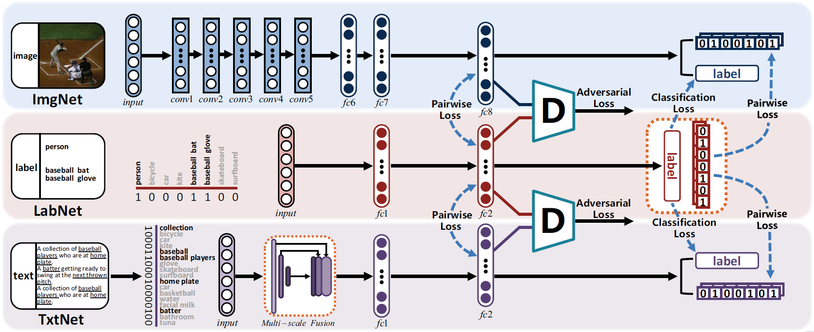
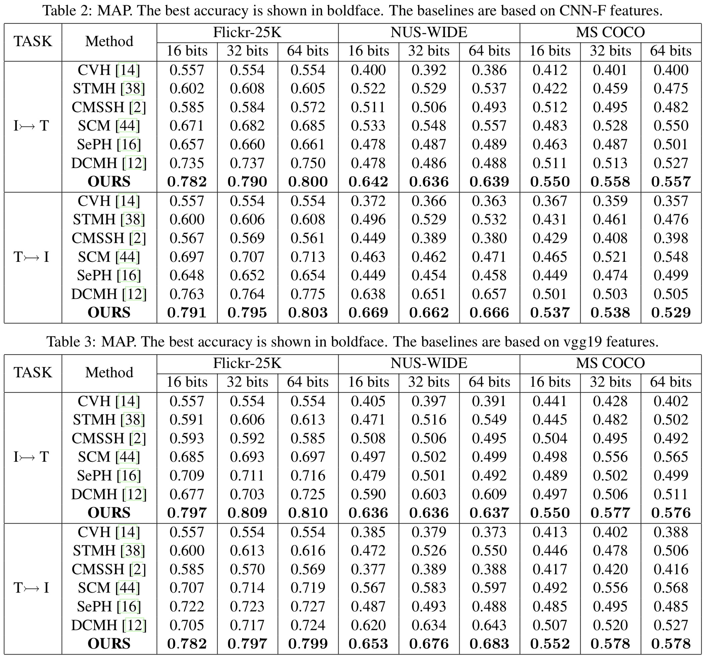

# SSAH
[Self-Supervised Adversarial Hashing Networks for Cross-Modal Retrieval](http://openaccess.thecvf.com/content_cvpr_2018/papers/Li_Self-Supervised_Adversarial_Hashing_CVPR_2018_paper.pdf)

## Abstract
Thanks to the success of deep learning, cross-modal retrieval has made significant progress recently. However, there still remains a crucial bottleneck: how to bridge the modality gap to further enhance the retrieval accuracy. In this paper, we propose a **s**elf-**s**upervised **a**dversarial **h**ashing (***SSAH***) approach, which lies among the early attempts to incorporate adversarial learning into cross-modal hashing in a self-supervised fashion. The primary contribution of this work is that two adversarial networks are leveraged to maximize the semantic correlation and consistency of the representations between different modalities. In addition, we harness a self-supervised semantic network to discover high-level semantic information in the form of multi-label annotations. Such information guides the feature learning process and preserves the modality relationships in both the common semantic space and the Hamming space. Extensive experiments carried out on three benchmark datasets validate that the proposed SSAH surpasses the state-of-the-art methods.

## Framework


## Result


## Citing SSAH
If you find SSAH useful in your research, please consider citing:
```
@inproceedings{li2018self,
  title={Self-Supervised Adversarial Hashing Networks for Cross-Modal Retrieval},
  author={Li, Chao and Deng, Cheng and Li, Ning and Liu, Wei and Gao, Xinbo and Tao, Dacheng},
  booktitle={Proceedings of the IEEE Conference on Computer Vision and Pattern Recognition},
  pages={4242--4251},
  year={2018}
}
@inproceedings{li2018deep,
  title={Deep Joint Semantic-Embedding Hashing.},
  author={Li, Ning and Li, Chao and Deng, Cheng and Liu, Xianglong and Gao, Xinbo},
  booktitle={IJCAI},
  pages={2397--2403},
  year={2018}
}
```
